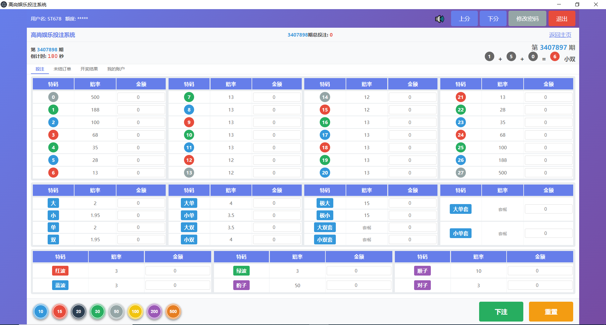
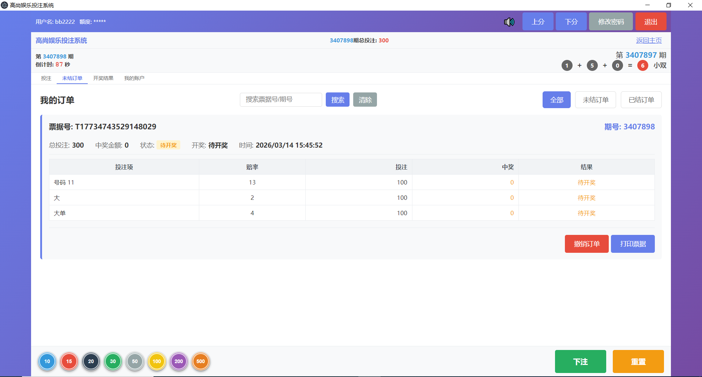
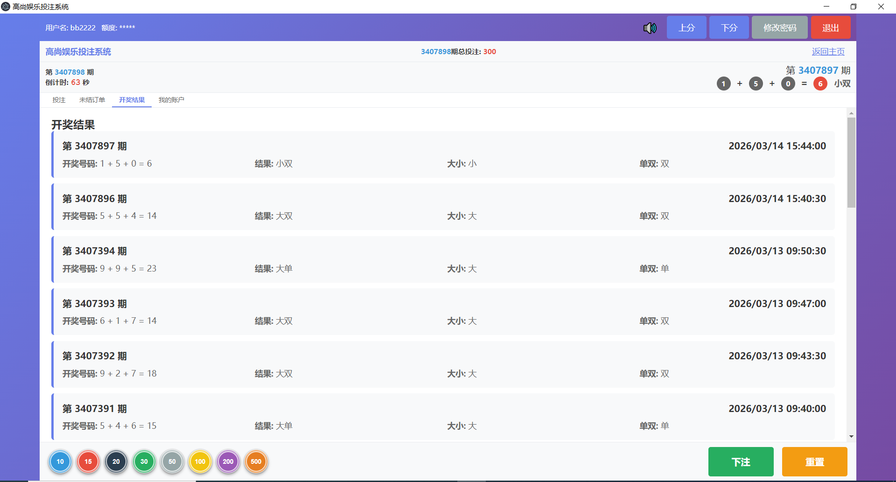
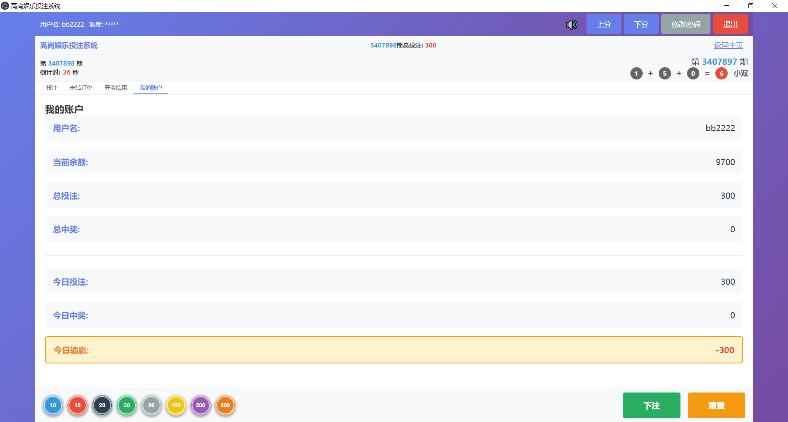
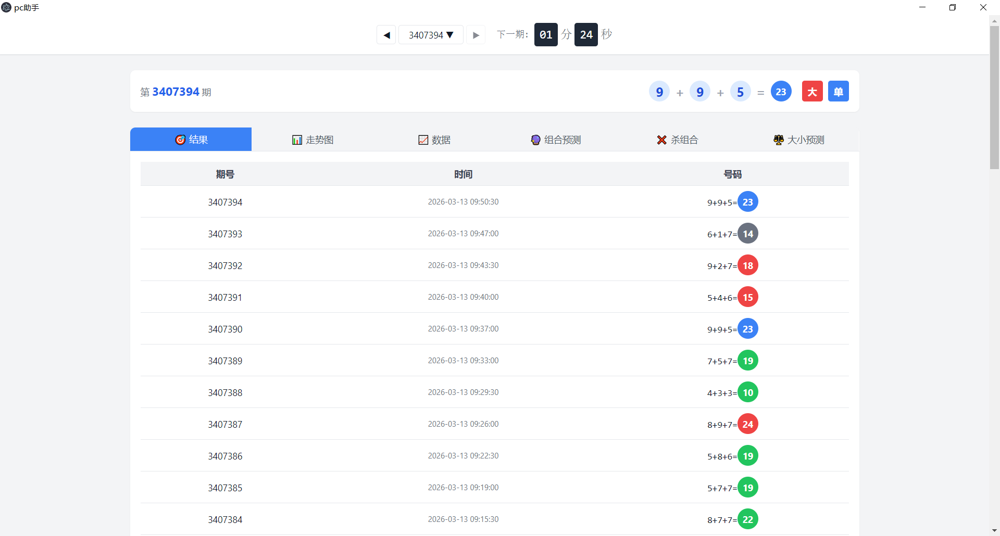
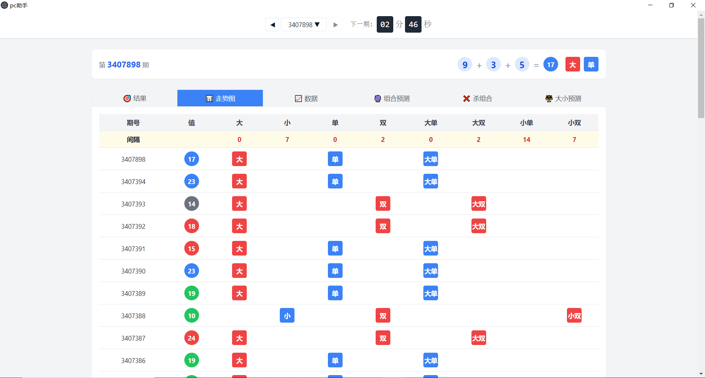

# 加拿大28 PC28 实体店投注站出票系统

2026最新加拿大28实体店投注出票系统，适用于线下实体店彩票投注站订单打印票据，配合热敏票据打印机，客户投注实时打单出票，自动结算，输赢统计，带后台，自带线下单机授权，另外附带一套彩票店同款大屏开奖走势图系统，供投注用户观看近期走势图，完整的全栈投注系统，包含前端界面、后端API服务和数据库。

## 系统架构

- **前端**: HTML + CSS + JavaScript (纯前端)
- **后端**: Node.js + Express
- **数据库**: MySQL
- **数据源**: pc28.help API

## 演示截图
 
 
 
 
 
 

## 功能特点

✅ **完整的用户系统**
- 用户注册/登录
- JWT认证
- 余额管理（上分/下分）

✅ **真实数据存储**
- MySQL数据库存储
- 用户数据、订单数据、开奖结果
- 数据持久化

✅ **投注功能**
- 多种投注方式（0-27号码、大小单双、特殊投注）
- 真实订单生成
- 票据打印

✅ **自动结算**
- 定时获取开奖数据
- 自动结算中奖订单
- 自动更新用户余额

✅ **实时数据**
- 获取真实开奖数据
- 实时期号和倒计时
- 历史开奖记录

## 快速开始

### 1. 安装依赖

```bash
npm install
```

### 2. 启动后端服务

```bash
npm start
```

或者使用开发模式（自动重启）：

```bash
npm run dev
```

### 3. 访问系统

打开浏览器访问：`http://localhost:3000`

## 数据库结构

### users 表（用户）
- id: 用户ID
- username: 用户名（唯一）
- password: 密码（加密）
- balance: 余额
- total_bet: 总投注
- total_win: 总中奖
- created_at: 创建时间
- updated_at: 更新时间

### periods 表（期号）
- id: ID
- period: 期号（唯一）
- status: 状态（betting/opening/closed）
- countdown: 倒计时（秒）
- total_bet: 总投注金额
- created_at: 创建时间
- updated_at: 更新时间

### results 表（开奖结果）
- id: ID
- period: 期号（唯一）
- number1, number2, number3: 开奖号码
- sum: 总和
- big_small: 大小（大/小）
- odd_even: 单双（单/双）
- combination: 组合（大单/大双/小单/小双）
- open_time: 开奖时间
- created_at: 创建时间

### orders 表（订单）
- id: ID
- ticket_no: 票据号（唯一）
- user_id: 用户ID（外键）
- period: 期号
- bet_data: 投注数据（JSON）
- total_amount: 总投注金额
- status: 状态（pending/win/lose）
- win_amount: 中奖金额
- created_at: 创建时间
- settled_at: 结算时间

## API接口

### 用户相关

- `POST /api/register` - 用户注册
- `POST /api/login` - 用户登录
- `GET /api/user` - 获取用户信息（需认证）

### 投注相关

- `POST /api/bet` - 提交投注（需认证）
- `GET /api/orders` - 获取用户订单（需认证）
- `GET /api/orders/:ticketNo` - 获取订单详情（需认证）

### 开奖相关

- `GET /api/current-period` - 获取当前期号
- `GET /api/results` - 获取开奖结果
  - 参数: `period`（可选）、`limit`（默认20）

### 账户相关

- `POST /api/deposit` - 上分/充值（需认证）
- `POST /api/withdraw` - 下分/提现（需认证）

## 定时任务

系统自动运行以下定时任务：

1. **获取开奖数据** - 每30秒获取最新开奖数据
2. **结算订单** - 每10秒检查并结算待结算的订单

## 默认账户

系统初始化时会创建默认测试账户：
- 用户名: `ST678`
- 密码: `123456`（或任意密码，简化版）

## 配置说明

### 修改端口

编辑 `server.js`，修改 `PORT` 变量：

```javascript
const PORT = process.env.PORT || 3000;
```

### 修改JWT密钥

编辑 `.env` 文件（如果不存在则创建）：

```
JWT_SECRET=your-secret-key-here
```

或在 `middleware/auth.js` 中修改：

```javascript
const JWT_SECRET = process.env.JWT_SECRET || 'your-secret-key';
```

## 项目结构

```
pc28/
├── server.js              # 服务器入口文件
├── package.json           # 项目配置
├── database/
│   └── db.js             # 数据库配置和初始化
├── routes/
│   └── api.js            # API路由
├── services/
│   ├── userService.js    # 用户服务
│   ├── orderService.js   # 订单服务
│   └── lotteryService.js # 开奖服务
├── middleware/
│   └── auth.js           # 认证中间件
├── public/               # 前端文件
│   ├── index.html
│   ├── styles.css
│   ├── app.js
│   └── api.js
└── data/                 # 数据库文件目录
    └── .env             # MySQL数据库配置文件
```

## 开发说明

### 前端修改

前端文件在 `public/` 目录下：
- `index.html` - 主页面
- `styles.css` - 样式文件
- `app.js` - 前端逻辑
- `api.js` - API调用封装

### 后端修改

- `server.js` - 服务器配置
- `routes/api.js` - API路由定义
- `services/` - 业务逻辑
- `database/db.js` - 数据库操作

## 注意事项

1. **数据安全**
   - 生产环境请修改JWT密钥
   - 密码应使用bcrypt加密（已实现）
   - 考虑添加HTTPS

2. **数据库备份**
   - 定期备份 MySQL 数据库（使用 mysqldump 命令）
   - 数据库文件包含所有用户和订单数据

3. **性能优化**
   - 生产环境建议使用MySQL/PostgreSQL
   - 添加Redis缓存
   - 优化数据库查询

4. **API频率限制**
   - pc28.help建议请求频率不低于1秒/次
   - 当前设置为30秒更新一次

## 故障排除

### 数据库初始化失败

删除 `data/` 目录，重新启动服务器：

```bash
rm -rf data/
npm start
```

### 端口被占用

修改 `server.js` 中的端口号，或使用环境变量：

```bash
PORT=3001 npm start
```

### 前端无法连接后端

检查：
1. 后端服务是否启动
2. 端口是否正确
3. 浏览器控制台是否有CORS错误

## 许可证

MIT License

## 备注

- 项目目前实现了众多的功能，项目也可以二次开发
- 欢迎提交宝贵意见，如有 bug，请提交 issue，我看到有时间会进行修复
- 如果这个项目对你有帮助，欢迎点一个 Star。  
- 如需私有化部署、二开接入或整套源码交付，欢迎联系。

## 免责声明

- 在使用本项目之前，您应自行评估并承担相应的风险。项目贡献者不保证本项目适合您的特定需求或用途，也不保证项目的完整性、准确性和及时性。

- 使用本项目即表示您同意自行承担所有风险和责任。对于因使用或无法使用本项目而引起的任何索赔、损害或其他责任，项目贡献者概不负责。

## 联系方式

如有问题或需要帮助，欢迎通过以下方式联系：

- **Telegram**: [@oniu888](https://t.me/oniu888)
